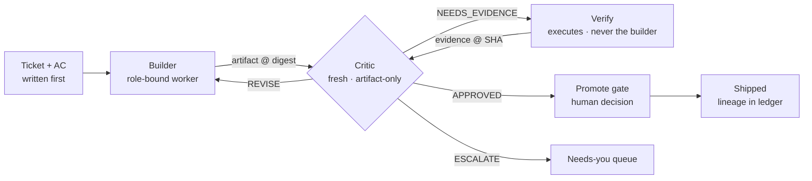

# Sagan

**Evidence-based multi-agent orchestration.** Named for Carl Sagan's rule:
*extraordinary claims require extraordinary evidence.* In Sagan, `APPROVED`
means verified — not plausible.

One accountable PM agent dispatches stateless specialist workers (frontend,
backend, research, …) against tickets whose acceptance criteria are written
*before* any work starts. Every boundary-crossing artifact faces a fresh,
isolated critic that can demand execution evidence instead of approving on a
read — and nothing user-visible ships without a non-builder verifier
recording commands, exit codes, and screenshots at a git SHA. It installs as
a self-contained `.sagan/` directory in any existing project; humans stay in
the loop through per-ticket promote gates and structured decision queues.

This repo is the **reference implementation**: the overlay, the role specs,
and a complete evidenced ticket run.

## The loop



Every dispatch, verdict, and evidence record lands in
`.sagan/ledger/events.jsonl` — the audit trail answers *which attempt
produced this, who judged it, against what evidence, and why it was
accepted.*

## The rules

| Rule | Meaning |
|---|---|
| AC before dispatch | Critic without AC is opinion; critic against AC is a contract |
| Adjectives are not criteria | Quality bars name a reference and are judged blind by the critic — mechanical or comparative, never "looks great" |
| Flags, never fixes | The critic judges; the builder fixes; nobody self-approves |
| Builder ≠ verifier | Structural, not cultural — the verifier is never the builder |
| Reading is not judging | `NEEDS_EVIDENCE` exists so render/runtime claims require execution output |
| APPROVED = verified | Ship requires critic approval **and** non-builder evidence at a git SHA |
| Caps are circuit breakers | Round limits → `ESCALATE` to a human, never silent approval |
| Decisions surface structurally | The PM presents open decisions as batched questions with recommended defaults — never buried in prose |

Verdicts: `APPROVED | REVISE | NEEDS_EVIDENCE | ESCALATE`.

## What's in the overlay

```
.sagan/
  sagan.yaml      # wiring: bindings, critique policy, round caps, gates,
                  #   your project's real test/typecheck/build commands
  roles/          # provider-neutral role specs (mission, inputs,
                  #   output contract, rubric)
  tickets/        # the work contracts (AC + per-role blocks + decisions)
  memory/         # per-task retros (pruned after synthesis)
  MEMORY.md       # rolling project learnings
  ledger/         # events.jsonl + evidence (screenshots, check records)
```

One directory to add; delete it to un-wire.

## Tickets are mirrored, not paraphrased

Context packs are **pointers** — a path and a ticket id, never a retyped copy.
That only works if the pointer resolves for the worker receiving it, so when
the ticket store is a tracker, Sagan mirrors each ticket to `tickets/<ID>.md`
and hands workers the file. Two things fall out of it: the acceptance criteria
sit in git at the same commit as the evidence, and no agent ever reads a
ticket that a PM retyped from memory.

The mirror has exactly **one writer per field**:

| | Owns | On fetch |
|---|---|---|
| **Tracker** | title, status, priority, assignee, description | regenerated |
| **Repo** | AC, Frontend, QA, Decisions, `builder_id`, `verifier_id`, `evidence_sha` | never touched |

Two writable copies of one field have no merge algorithm, so no field has two
writers. Going back the other way, repo blocks return to the tracker **word for
word** with the git SHA — a summarized write-back would reintroduce, at the
sync boundary, exactly the paraphrase the pointer rule exists to prevent.

Sprint scope batches the *planning* — AC authoring and the decision round
across several tickets at once — and still builds one ticket at a time.
Concurrent builders need worktrees, a file-disjointness check, and a
sprint-level round cap; none of those exist yet, and nothing at v0 would catch
two agents editing the same file.

## Worked example: T-001

This repo ran its own first ticket. The trail is committed:

- [`tickets/T-001.md`](tickets/T-001.md) — AC written before dispatch;
  builder, verifier, and evidence SHA recorded on the ticket.
- Round 1: the critic returned `NEEDS_EVIDENCE` — it refused to approve
  375px legibility and dark-mode rendering from reading source, and caught
  an AC clause it couldn't judge from inside its isolation set.
- Verify bound evidence to commit `03f2d22`:
  [screenshots at both widths in both color schemes](.sagan/ledger/T-001/),
  a measured `scrollWidth` (no horizontal scroll), and quoted attestations.
- Round 2: a second fresh critic reviewed artifact **plus** evidence —
  `APPROVED`, zero findings. Human promoted at the gate.
- Every step: [`.sagan/ledger/events.jsonl`](.sagan/ledger/events.jsonl).

## Using it in your project

Sagan v0 is files + protocol — any capable coding agent session can act as
the PM by reading `sagan.yaml` and the role specs.

- **With the installer** (a [Claude Code](https://claude.com/claude-code)
  skill, `sagan-wire`): probes your project's entry point (CLAUDE.md /
  AGENTS.md), captures your real gate commands into `sagan.yaml`, installs
  the overlay, and wires one consent-gated marker block so future sessions
  are Sagan-aware. Supports `--update` resync with local-edit detection.
- **Manually:** copy `.sagan/` from this repo, empty the ledger and
  tickets, set your gate commands in `sagan.yaml`, and point your agent's
  project context at it.

Then: copy `tickets/T-000-example.md`, write the AC, and run it through the
loop with the two run skills — tickets can live as files in your repo or in
Linear.

The toolkit is three skills, one per phase:

- **`sagan-wire` installs** (above).
- **`sagan-start` opens.** The startup sequence in order: read
  `sagan.yaml`, mirror the ticket store into local markdown, check every
  ticket's AC (no criteria → non-zero exit, not a reminder), ask whether
  this is one ticket or a sprint, log `run.started`, and hand back a
  dispatch-ready brief. A ticket that's still plain prose isn't your
  homework: the PM drafts its AC and Method from your description and
  you confirm or edit them in the question round. `--writeback=<ID>`
  sends a ticket's repo blocks back to the tracker verbatim.
- **`sagan-run` drives.** It consumes the brief and owns the circuit:
  dispatches the builder with pointer packs, a fresh artifact-only critic
  (verdict envelope schema-validated), a verifier that is never the
  builder and binds evidence to a git SHA, round caps that escalate
  instead of quietly shipping — and stops at the promote gate, which is
  yours. Retros synthesize into `.sagan/MEMORY.md` when the run closes.

### What a ticket looks like

**You never author this file.** You brief the PM the way you'd brief a
person: a paragraph on what, a paragraph on how, a paragraph on what
done means, and one closing line. A real one, in full:

```text
Build the hero for sagan.run. Headline eight words or fewer,
a subhead, one CTA saying "Get started" → /docs. No secondary.

Only the shadcn primitives we have installed. Type-led — type
carries the hierarchy, whitespace is the design. One accent
color, used once. Everything from tokens. Nothing animates on
load.

Done means all of these: delete the accent and it still reads
premium; nothing's filling space; a stranger knows what we do
from the headline and subhead alone; every value traces to a
token; buttons are buttons; one h1, heading order in sequence;
focus visible, tab order follows reading order; alt text or
explicitly decorative; tap targets 44 by 44.

Any one of those you can't hit, stop and tell me which and why.
```

The PM compiles that into the ticket's contract, same spine: your
words stay as the description, verbatim. The how-paragraph becomes
`## Method`, and its hard constraints (tokens only, one accent, no
load animation) become mechanical AC items. Every clause of your
done-paragraph becomes one enumerated AC item — mechanical checks
route to verify, judgment checks ("still reads premium") route to the
fresh critic with verify-supplied evidence like an accent-stripped
capture. Your closing line is Sagan's ESCALATE rule in your own words:
work never quietly ships as a near-miss. You approve or edit the
compiled contract at a gate before any agent starts — including
anything the brief left open, like the exact headline.

The compiled ticket follows a What → How → Bar spine: your prose
description says what, `## Method` says how *this* ticket gets built
(item decomposition, correctness-or-quality lane, round-1 evidence, a
comparison reference when the bar is comparative), and `## AC` is the
bar — mechanical criteria, or a blind comparison against a named
reference for quality-shaped work. Never adjectives. Abridged from the
worked example (full ticket:
[`tickets/T-000-example.md`](tickets/T-000-example.md)):

```markdown
---
id: T-000
title: Marketing hero (shadcn primitives)
status: Backlog
# repo-owned — set by the run, carried across every fetch
builder_id: frontend-claude-r1
verifier_id: verify-claude-r1     # never the builder
evidence_sha: 9be4459             # proof binds to this commit
---

<!-- your prompt, verbatim (abridged here) -->
Build the hero for sagan.run. Headline eight words or fewer,
a subhead, one CTA saying "Get started" → /docs. No secondary.
Only the shadcn primitives we have installed. One accent, used
once. Everything from tokens. … Any one you can't hit, stop
and tell me which and why.

<!-- the PM compiled everything below from that brief;
     you confirmed it at a gate before any work -->

## AC
1. `h1` exact text `Ship work you can prove.` — proposed at
   the gate, approved; the page's only h1; ONE CTA
   `Get started` → /docs.
2. Only installed primitives; tokens only — no new hex,
   accent exactly once, no load animation.
3. Buttons are buttons; one h1, heading order in sequence;
   focus visible; targets ≥ 44px; axe zero critical.
4. `npm run build` + `npm run typecheck` exit 0.
5. Craft, on verify's captures: accent-stripped still reads
   premium; nothing fills space; a stranger gets it from
   headline + subhead.

## Method
items: copy · CTA · tokens · a11y
lane: quality (cap 3)
round-1 evidence: 375/1440 light+dark · accent-off · axe run

## Frontend
r1 build note — what was built, key choices, nothing self-approved.

## QA
r1 verify — per-AC PASS/FAIL with evidence at `9be4459`.

## Decisions
2026-08-08 — promote gate (human): promote.
```

## Status — v0, honest

- ✅ Validated: the contract-shaped loop (AC-first, isolated critique,
  evidence-bound verification, promote gates, memory tiers) — proven by
  the T-001 run, and re-proven skill-driven end to end by WHA-151 (the
  first `sagan-start` → `sagan-run` circuit: round-1 APPROVED on real
  evidence, with a schema-clean critic envelope).
- ⚠️ Mostly not built yet: **runtime enforcement.** Round caps, critic
  isolation and gates are still interpreted by the PM model, not enforced by
  code. The one exception is `ac_before_dispatch`: when a run opens through
  `sagan-start`, a ticket with no enumerated acceptance criteria fails with a
  non-zero exit code rather than a reminder. Dispatch by hand and nothing
  checks it. That asymmetry is the point of the roadmap item — nothing
  safety-critical should depend on a model remembering to stop.
- Roadmap: enforced tier (caps, isolation, containment floors as code),
  provider-heterogeneous bindings (Claude / Codex / Grok / Kimi with
  per-binding containment levels), event-store + team surface.

The design behind this survived three adversarial review rounds (QA,
product/architecture, driver-level code review) before v0 was built.

---

*A fleet of small vessels, steered by evidence.* — sagan.run
